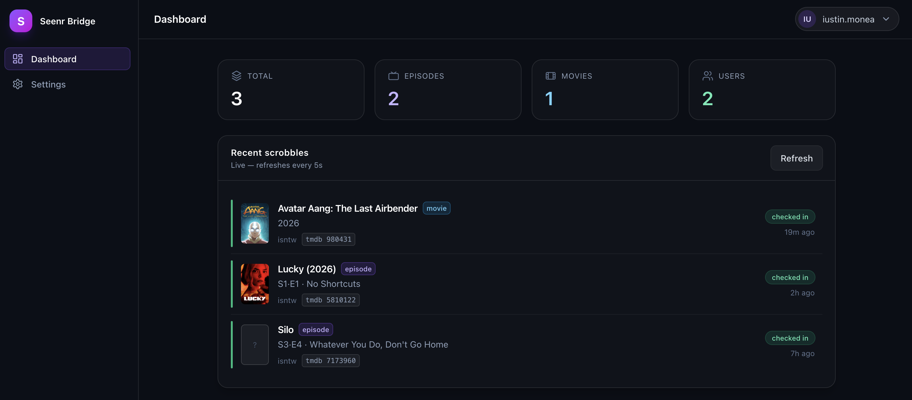
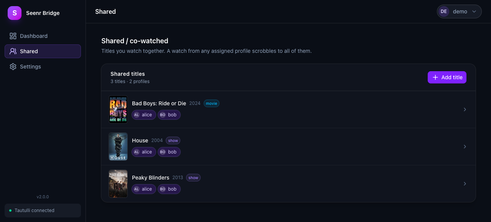
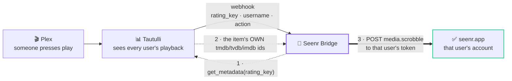

# Seenr Bridge

A small self-hosted service that makes **Tautulli → [seenr](https://seenr.app)** scrobbling work correctly for **TV episodes and movies**, for **every Plex user** — with a web UI to set it up and watch it work.




*Dashboard — one row per watch. A co-watched title shows every profile it reached.*



*Shared — titles you watch together, and who each one checks in for.*

## Why it exists

seenr identifies an episode by its **own** TMDb/TVDb/IMDB id. But Tautulli's webhook template can only emit the **show's** id for an episode ([Tautulli #2510](https://github.com/Tautulli/Tautulli/issues/2510) — open and unresolved). So a raw Tautulli webhook sends the *series* id, seenr resolves it as an *episode* id, and you get checked in on the **wrong show**.

Plex's own webhooks carry the right episode ids, but only fire for the **server owner** — not shared users. Tautulli sees everyone's playback, so the bridge keeps Tautulli as the source and supplies the missing piece: it re-looks-up each item's real ids by `rating_key`, rebuilds a proper Plex `media.scrobble` payload, and forwards it to the right user's seenr token. Matching is ID-based and title-independent, for episodes and movies alike.



The dotted pair is the part that matters: the bridge asks Tautulli about the item
it was just told about, because the webhook alone can't say which *episode* was
watched — only which show.

## Features

- **Correct episode + movie check-ins** by real external id — fixes the wrong-show bug.
- **One webhook covers every user.** The bridge routes to the right seenr account by username.
- **Per-user config** — each user has their own token, an on/off switch, and a choice of TV / movies.
- **Co-watching** — mark a title as shared and a watch by any assigned profile checks in for all of them, optionally backfilling what they've already seen.
- **One-click Tautulli setup** — creates or updates the webhook through Tautulli's own API, or copy-paste it by hand.
- **Live dashboard** — recent scrobbles with poster art, the matched id, the event type, and per-user delivery status.
- **Login-protected.** First run creates your account; registration then closes.

## Requirements

- Docker + Docker Compose
- A running [Tautulli](https://tautulli.com) instance (with an API key) monitoring your Plex server
- A [seenr](https://seenr.app) account and each user's Plex scrobble token

## Install

**Quickest — no clone, just the pre-built image:**

```bash
mkdir seenr-bridge && cd seenr-bridge
curl -O https://raw.githubusercontent.com/isntw/seenr-bridge/main/docker-compose.yml
docker compose up -d
```

…or paste this into a `docker-compose.yml` and run `docker compose up -d`:

```yaml
services:
  seenr-bridge:
    image: ghcr.io/isntw/seenr-bridge:latest
    container_name: seenr-bridge
    restart: unless-stopped
    ports:
      - "8687:8687"
    volumes:
      - ./data:/app/data
```

**Build from source instead:**

```bash
git clone https://github.com/isntw/seenr-bridge.git
cd seenr-bridge
docker compose -f docker-compose.build.yml up -d --build
```

Then open **http://\<host\>:8687** and create your account.

> The bridge must be reachable from your Tautulli container/host — Tautulli posts webhooks to it.

**Updating:** `docker compose pull && docker compose up -d`

## Setup

Everything lives on the **Settings** page, in two steps.

**1 · Tautulli** — two jobs, in order, because the second needs the first:

- **Connection** — your Tautulli URL (e.g. `http://tautulli:8181`) and API key (Tautulli → Settings → Web Interface → API key). **Test connection**, then **Save**.
- **Event webhook** — pick which triggers to enable (**Watched** is the one that matters; Play/Stop/Pause/Resume are optional "now playing" events) and hit **Sync to Tautulli**. That creates a single `Seenr Bridge` webhook notifier pointed back here, with no per-user conditions. Prefer to do it yourself? Expand **Set it up manually instead** for the exact URL, headers and JSON body.

**2 · seenr users** — one entry per user: pick their Plex **username** (auto-populated from Tautulli once connected, or type it) and paste their seenr **token** — the part after `/scrobble/plex/` in that user's seenr webhook URL. **Configure** on a user sets what they sync or pauses them.

**Forwarding** is a master switch in the page header, next to the live status line. It saves the moment you flip it.

That's it — play something past the watched threshold and it appears on the Dashboard and in seenr.

## Co-watching (Shared)

The **Shared** page is for titles more than one person watches together. Add a title, tick who watches it, and a watch by any assigned profile checks in for all of them.

- **Add title** opens a picker — search your TV or movie library, tick the profiles, and choose what to do about watches that already happened: sync them all retroactively, or start from now.
- Clicking a row opens the same modal to change who it's shared with, re-run a retroactive sync, or remove it.

Retroactive syncing replays what each profile has already finished, so it can post a lot of scrobbles at once. The modal always defaults to **only new watches** — a backfill is something you opt into, in both add and edit.

## Advanced

Under **Settings → Advanced**:

- **seenr base URL** — the endpoint each user's token is appended to (default `https://seenr.app/api/v1/scrobble/plex`, correct for seenr.app).
- **Bridge public URL** — how Tautulli reaches the bridge. Blank auto-detects from your browser's address; set it only behind a reverse proxy or custom domain.

**Test a scrobble** (also under Settings) runs one item through the real pipeline on demand. Pick it by drilling TV → season → episode, choosing a movie, or pasting a `rating_key` directly. **Preview** builds the payload without contacting seenr; **Send for real** forwards it and records an event.

Change password and log out live in the account menu, top-right.

## Security

- The UI and API require login, **except** `/api/webhook/tautulli` (Tautulli can't authenticate), `/api/health`, `/api/version`, and the auth flow — `/api/auth/status`, `/login`, `/register`, `/logout`. Everything else needs a session, including `/api/auth/change-password`.
- Passwords are hashed with scrypt; sessions are httpOnly cookies.
- Because the webhook endpoint is unauthenticated, keep the bridge on a trusted network. If you expose it publicly, put a reverse proxy with its own protection in front.

The full route list, and the webhook's exact request shape, are in [`docs/api.md`](docs/api.md).

## Data & backup

All state — settings, your account, user mappings, shared titles, event history — is the single SQLite file at **`./data/seenr-bridge.db`**, mounted into the container. Back that up and you've backed up everything. Event history is capped at the most recent **1,000** rows.

## Development

```bash
npm install
npm run dev        # http://localhost:8687

npm test
npm run typecheck
```

Or in Docker: `docker compose -f docker-compose.dev.yml up -d`

Working on the code? `CLAUDE.md` documents the conventions and the non-obvious traps.

## Stack

Nuxt 4 + Vue 3 + Nuxt UI + Pinia (client) · Nitro + better-sqlite3 + TypeScript (server) · Docker.
